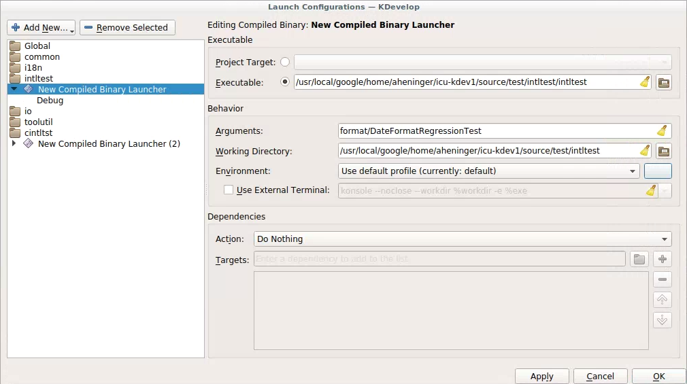
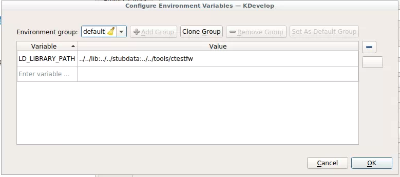

# Kdevelop Setup for C/C++ Developers

## Introduction

[Kdevelop](https://www.kdevelop.org/) is an IDE with features similar to Eclipse
- compilation & error checking while you type, pop-up help on most identifiers,
integrated debugger, etc.

Setting it up for ICU takes a bit of work, but it works well once configured.

## Installation (Linux)

` sudo apt-get install kdevelop`

## Configuration

There is a one-to-one correspondence between kdevelop "projects" and icu
Makefiles.

The setup process consists mostly of creating a kdevelop project for each
Makefile of interest, then adjusting the project properties to account for
settings that kdevelop did not deduce from the original Makefile.

kdevelop stores the configuration in a series of files with the suffix .kdev4.
Unfortunately, these are scattered through the source hierarchy, and include
absolute hard-coded paths. I haven't figured out a way to make these
conveniently re-usable or retargetable.

Here are the steps to set up kdevelop to work with ICU:

*   Set up a svn client workspace to use, with a full copy of ICU4C. Because
    kdevelop's configuration can't be easily moved between directories, dedicate
    a svn workspace to kdevelop, and use `svn switch` to move the workspace to
    different branches.

*   runConfigure, to generate the Makefiles that will be the basis for the
    kdevelop projects. Disable renaming, allowing the IDE links for plain C
    functions work. This setup uses an In-source build, I have not tested with
    out-of-source builds. Build and test to verify the copy of ICU.
    `cd source`
    `./runConfigureICU --enable-debug --disable-release Linux
    --disable-renaming`
    `make -j6 check`
*   Start kdevelop
*   Import the various projects. The following make a consistent set:

> > common

> > i18n

> > io

> > toolutil

> > intltest

> > cintltst

> > Others (various tools) can be added if you are working on them.

> For each,

> > From the "Project" menu, select "Open / Import Project..."

> > Navigate to a directory containing an ICU Makefile, e.g. .../source/common,
> > and "Open"

> > A "Project Information" dialog should appear, and should show
> > Name: common (or whatever directory/project you are doing)
> > Project manager: Makefile (Custom Makefile Project Manager)
> > Push "Finish"
> > The new project should now appear in the panel on the left of the main
> > kdevelop window.
> > Right-click the new project, and select "Open Configuration..."
> > Select "Project Filter", then "+Add" entries to exclude the following file
> > types from the project:
> > \*.rc
> > \*.d
> > msvcres.h (common project only)
> > Push "Apply"
> > Select "Language Support" -> "Includes/Imports" and add full absolute paths
> > for the include paths from the table, below. The absolute paths will be
> > specific to your setup, e.g.
> > `/usr/local/google/home/aheninger/icu-kdev/source/common` `.../source/common` might become something like

> > The "Batch Edit" option is the fastest way to enter these. (I have tried and
> > failed to find a way to use variables or relative paths for these)

> > Select "Language Support" -> "Defines" and add the variable definitions
> > needed for the project, as listed in the table below. Batch Edit is again
> > the easiest; the definitions from the table can be pasted in as-is.
> > Select "OK" to close the configuration window.

> > **Project Include Paths Preprocessor Defines** common .../source/common/
> > U_COMMON_IMPLEMENTATION=1
> > U_DISABLE_RENAMING=1 i18n.../source/common/
> > .../source/i18n/ U_I18N_IMPLEMENTATION=1
> > U_DISABLE_RENAMING=1 io .../source/io/
> > .../source/common/
> > .../source/i18n/ U_IO_IMPLEMENTATION=1
> > U_DISABLE_RENAMING=1 toolutil.../source/tools/toolutil/
> > .../source/common/
> > .../source/i18n/ U_TOOLUTIL_IMPLEMENTATION=1
> > U_DISABLE_RENAMING=1 cintltst.../source/common/
> > .../source/i18n/
> > .../source/tools/ctestfw/
> > .../source/tools/toolutil/ U_DISABLE_RENAMING=1 intltest .../source/common/
> > .../source/i18n/
> > .../source/io/
> > .../source/tools/toolutil/
> > .../source/tools/ctestfw/ U_DISABLE_RENAMING=1

*   Verify that the projects have no errors. For each project
    *   Expand the project in the "projects" panel on the left side of the
        window.
    *   Open a source file (.cpp, .h or .c) from the project (double-click it).
    *   Open the "Problems" pane at the bottom of the screen, if it's not open
        already.
    *   Choose "Scope: Current Project" from the top of the Problems pane.
    *   There should be no errors (Red circles). There should be many warnings
        and notices.

> Note that the error list won't be complete or accurate until kdevelop finishes
> analyzing the source. When the configuration settings change it reanalyzes
> everything, which takes several minutes. See the progress bar at the lower
> right.

*   Rename the Session. A kdevelop session is a group of related projects that
    can be opened together. We've been working in the un-named default session.
    From the "Session" menu, select "Rename Current Session..."

## Run a Test

Choose "Run menu" -> "Configure Launches..."

Select intltest.

Click "Add New"

Select "Compiled Binary"

Specify what to run, and its parameters. For example,

On the "Environment" line in the above box, click on the unlabeled button on the
right, and add LD_LIBRARY_PATH settings.

From the main menu, select Run->Execute Launch, or Run->Debug Launch, and the
test should run.

Try setting a break point in one of the executed source files (CTRL + ALT + B)
and check out the debugger.
