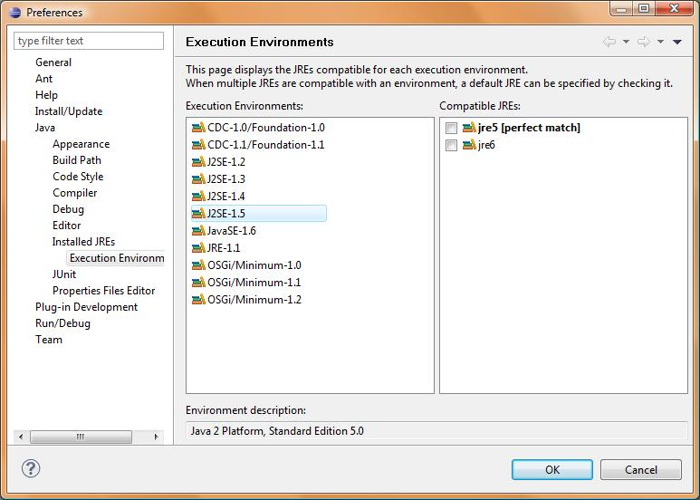
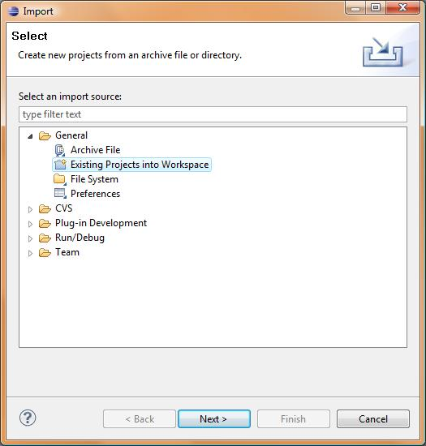
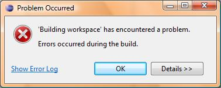
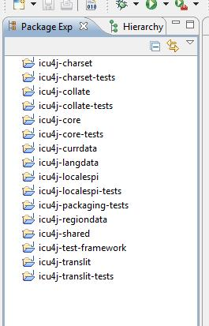
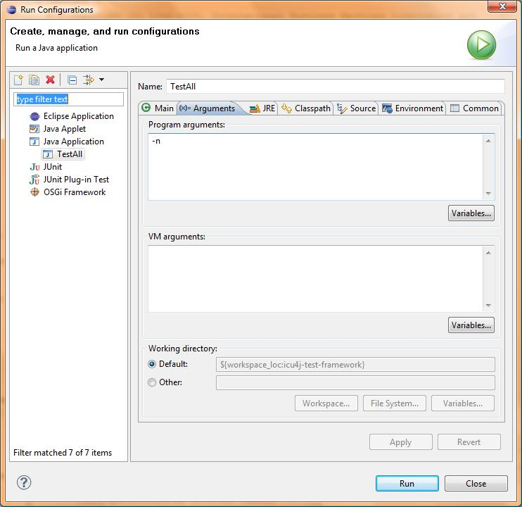
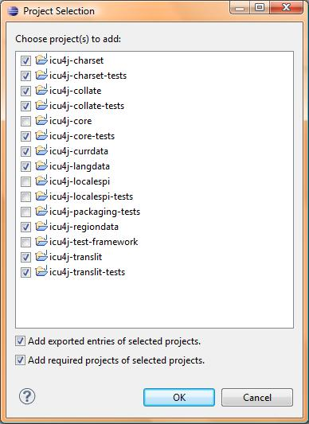
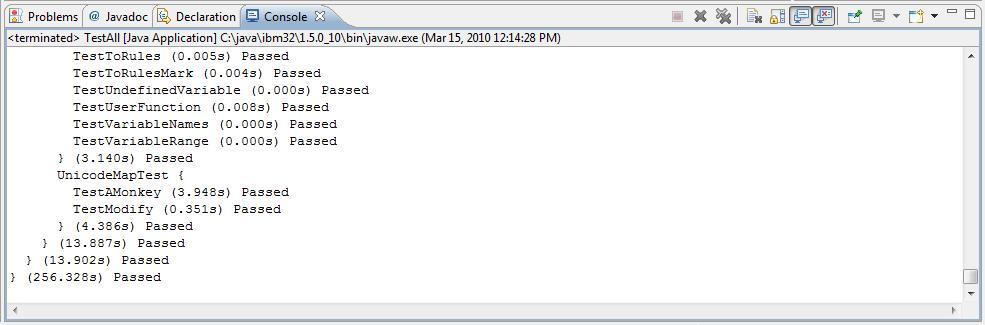

# Eclipse Setup for ICU4J Users

*This page is out of date, and seems to be a duplicate of [Eclipse Setup for
Java Developers](../java/eclipse-setup-for-java-developers/index.md), so please
read that page instead.*

[TOC]

**Note:** This document explains how to build and debug ICU4J 4.4 on Eclipse
IDE. If you plan to contribute code to ICU4J, please also refer following links.

*   <http://site.icu-project.org/design/icu4j-development-with-eclipse>
*   <http://site.icu-project.org/setup/subversion>

## Prerequisites

*   Eclipse IDE - Any Eclipse IDE package including the Java IDE. This
    instruction uses Eclipse 3.5 on Windows operating system, but other versions
    of Eclipse should also work.
*   J2SE JRE 5 - Alternatively, you can use JRE 6 for all ICU4J sub-components
    instead, but you will see some warnings.
*   J2SE JRE 6 - This is required for building ICU4J Locale SPI.

## Getting ICU4J Source

The ICU4J source package can be downloaded from [the official ICU4 download
page.](../../download/index.md) If you want to work on the latest development
snapshot or a specific version of ICU4J, you can directly export the source
package from the ICU4J SVN repository. For accessing the ICU source code
repository, please see [this page](../../index.md). This instruction assumes
that ICU4J source package is available at C:\\icu4j on Windows operating system.
If you have ICU4J source package in a different location or using another
operating system, please replace C:\\icu4j with the actual location.

## Configuring Workspace

The ICU4J source package includes several ICU4J sub-component project files.
These projects refer JRE via Java Execution Environments. Before importing the
ICU4J projects, you must set up Java Execution Environments by following steps.
1. Start Eclipse IDE. Eclipse will prompt you to select a workspace first time.
This instruction assumes that you create a new workspace for ICU4J. (Of course,
you can use an existing workspace and import ICU4J projects there.)
2. Select \[**Window**\] - \[**Preferences**\] to open workplace preferences
screen.
3. Navigate to **Java** - **Installed JREs** - **Execution Environments** in the
tree view in the left pane, then select **J2SE-1.5** in the Execution
Environments list at the center.

If you do not see any matches in the Compatible JREs list, you have to configure
a JRE in the workspace by navigating into **Java** - **Installed JREs**, then
click **Add** to register a matching JRE (for this case, JRE 5) installed on
your system.
**Note:** You do not need JREs showing \[perfect match\] in the list to build
ICU4J on Eclipse. For example, JRE 6 can be used for ICU4J sub-component
projects using J2SE-1.5 as the execution environment. However, Eclipse IDE
displays warnings if there is no perfect match.
4. Also make sure the execution environment **JavaSE-1.6** has at least one
match above. If no matches, register JRE 6 on your system to the workspace.

## Importing ICU4J projects

Once you configure the workspace, the next step is to import ICU4J sub-component
project files into the workspace. This task is done by following steps.
1. Select \[**File**\] - \[**Import**\] to open the screen below.

Select **Existing Projects into Workspace** in the screen above, then click
**Next**.
2. Specify C:\\icu4j\\main as the root directory (If you have the source package
in a different directory, replace C:\\icu4j with the actual location), then
click browse.

You should see ICU4j sub-components projects (icu4j-charset,
icu4j-charset-tests...) in **Projects** list like above. Click **Finish**.
3. While importing the projects, you might see the error message below. But you
can just click OK and ignore the message.

4. After the projects are imported into the workplace, you should see the list
of projects in the **Package Explorer** view as below. (Note: All error
indicator icon should be disappeared after Eclipse IDE finishes the import
operation.)

5. Build all ICU4J projects by selecting \[**Project**\] - \[**Build All**\] in
the menu. Now, ICU4J projects imported into the workplace is completely built
and ready to work.

6. If you are going to work on sample/demo code, also import the projects under
the **==demos==** tree parallel to main.

7. If you are going to work on tools, also import the projects under the
==**tools**== tree parallel to main.

## Run the ICU4J Test Suite

After the ICU4J projects are imported and built on the Eclipse IDE, you can run
the ICU4J test suite to make sure the ICU4J works properly. To run the test
suite, follow the steps below.
1. In **Package Explorer** view, open **icu4j-test-framework** project, then
navigate into **src** - **com.ibm.icu.dev.test** and select **TestAll.java**
2. Select \[**Run**\] - \[**Run Congigurations...**\] in the menu to open the
screen, then select **Java Application** in the left pane. Click **New launch
configuration** icon  to create a new configuration
for **TestAll.java**.

3. Open **Arguments** tab and specify -n as **Program arguments**.

4. Open **Classpath** tab and select **User Entries** in the **Classpath:**
list, then click **Add Projects...** to open the **Project Selection** screen
below.

In this list above, check icu4j-charset, icu4j-charset-tests, icu4j-collate,
icu4j-collate-tests, icu4j-core-tests, icu4j-currdata, icu4j-langdata,
icu4j-regiondata, icu4j-translit and icu4j-translit-tests, then click **OK**.
(Note: icu4j-core is already included in the classpath because of the build
dependency. Also, ICU4J Locale SPI test suite is not a part of the regular ICU4J
test suite.)
5. In the **Run Configurations** screen, click **Run** to launch the test suite.
You should see test output in the **Console** window in the Eclipse IDE. The
test suite usually takes a few minutes. After all tests are passed, you should
see the log like below in the **Console** window.

Note: On Eclipse Juno (4.2) releases, you may need to run \[Project\] - \[Build
All\] to let ICU's customer builders to copy data files to appropriate
locations. I did not see this issue in Eclipse 3.x and clean projects
automatically triggered the desired ICU customer target.

## Background

*   JDK is not required for running Eclipse itself.
*   For building ICU4J on Eclipse, you do not need JDK (one exception:
    icu4j-build-tools project).
*   On Eclipse, we use Eclipse's own Java compiler, not javac in JDK.
*   Although Eclipse has its own Java compiler, it does not have JRE runtime
    libraries.
*   JRE 5 is the lowest level JRE supported by ICU4J, so we configure ICU4J
    projects to refer Java runtime library via execution environment J2SE-1.5.
    (Exception: icu4j-localespi/icu4j-localespi-tests require J2SE-1.6, because
    Java Locale SPI was introduced in Java 6)
*   JRE 6/7 satisfy the minimum execution environment J2SE-1.5, but contain new
    APIs not available in JRE 5. If we write code depending on new APIs in Java
    6/7, it does not work on JRE 5. Eclipse cannot detect such dependencies,
    therefore, Eclipse displays the warning. You can ignore the warning for
    building ICU4J, but I recommend ICU4J developers to install JRE 5 and use it
    for this purpose.
*   Only icu4j-build-tools project requires JDK, because of JavaDoc library
    dependency. JavaDoc classes are not a part of Java runtime library (rt.jar).
*   When we build ICU4J release binaries, we use JDK's javac, not Eclipse
    version. JDK 6 is the current "reference platform", so we use JDK 6 for this
    purpose, not JDK 5.

For ICU developers, the suggestion is to install:

*   Eclipse 3.5.x (3.6 will be ready soon)
*   JDK 6 (including JRE 6) - this is also used for ant command line build
*   JRE 5 (for execution environment J2SE-1.5)

For non-ICU developers, JRE 5 is optional.
