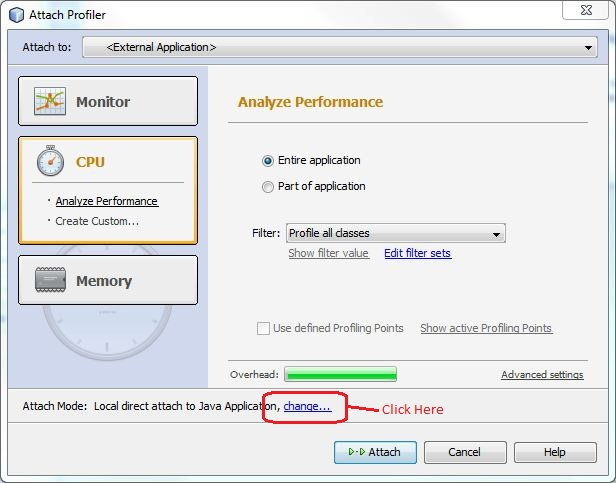
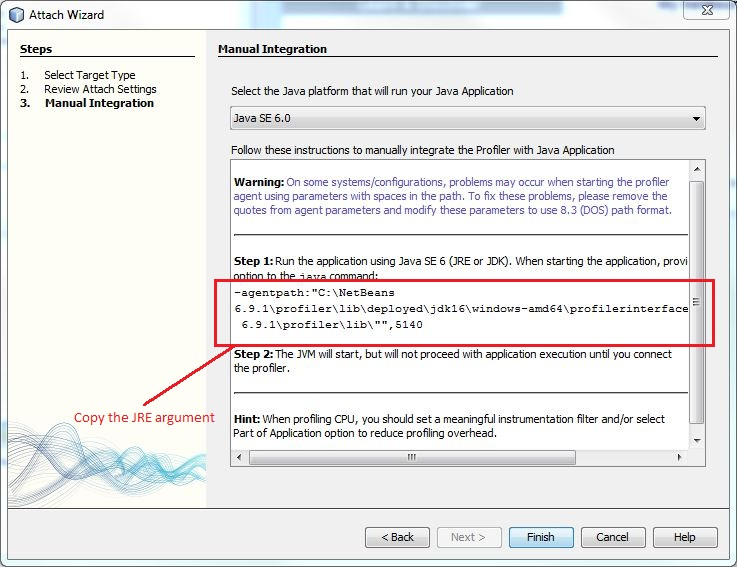
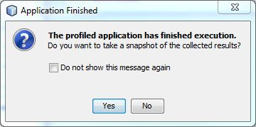
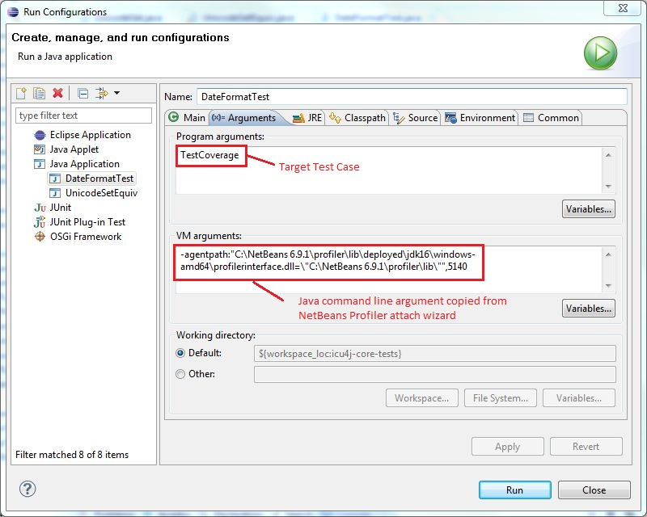

# Profiling ICU4J code with NetBeans profiler

Eclipse provides optional package called TPTP including Java profiler. In the
past, I set up TPTP and profiled ICU4J code. Unfortunately, I experienced
various issues such as crash, slow operation and suspicious profile results. I
tried TPTP for every new eclipse release, but I had no luck. These days, I'm
using profiler coming with NetBeans instead of TPTP. NetBeans profiler is easy
to use, reliable and faster than TPTP. I think the tool is also useful for other
ICU4J developers, so I'm going to explain how to use the NetBeans profiler in
this document.

### NetBeans Installation

Just go to the [NetBeans site](http://netbeans.org/) to download the installer
for your platform. There are several package options available. For most of you
developing ICU4J just need "Java SE" package.

To use NetBeans Profiler, you also need Oracle JRE. If you do not have one,
download JRE (or JDK) 5 or later versions from Oracle site.

### Attaching NetBeans Profiler to your Java program

You can easily attach NetBeans Profiler to your Java program by following steps,
without creating a project on NetBeans IDE.

1.  Start NetBeans IDE
2.  For the first time, you need to calibrate the profiler to a JRE. This is
    done by following steps.
    1.  Select \[Tools - Java Platforms\] to open Java Platform Manager.
    2.  Click Add Platform... to choose platform folder of the JRE which you're
        going to use for profiling. Follow the instruction to register a JRE.
    3.  Select \[Profile - Advanced Commands - Run Profiler Calibration\] from
        the IDE menu. The dialog should list the JRE you registered in the
        previous step. Select it and click OK.
3.  Select \[Profile - Attach Profiler\]. Select CPU on the left, then click
    "change..." above the "Attach" button.

    

4.  In the Attach Wizard window, just click next until the 3rd screen. Then
    select the version of JRE and copy the java command argument as explained in
    the screen.

    

5.  Click finish - now it's ready to attach NetBeans Profiler to your Java code.
6.  Start java program with the java command argument saved in the step 4. For
    example,
    java -agentpath:"C:\\NetBeans
    6.9.1\\profiler\\lib\\deployed\\jdk16\\windows-amd64\\profilerinterface.dll=\\"C:\\NetBeans
    6.9.1\\profiler\\lib\\"",5140 TestJavaClass
7.  The java code execution should be on hold and waiting for NetBeans Profiler
    to be attached. Select \[Profile - Attach Profiler\] on NetBeans IDE, then
    click "Attach". It takes a while running the code and collecting profiling
    results, then a next dialog should be popped up. Click "Yes" to see the
    profiling results.

    

### Using NetBeans Profiler on Eclipse IDE

You can use NetBeans Profiler from a Java program launched by Eclipse IDE. This
is probably typical use case for ICU4J developers. The steps below explains how
to profile DateFormatTest/TestCoverage

1.  Open DateFormatTest.java in icu4j-core-tests project on Eclipse IDE.
2.  Enter Ctrl+F11 (or click Run icon or select \[Run - Run\]) to run the test
    once. This operation will create a Run Configuration for DateFormatTest.
3.  Select \[Run - Run Configurations\] from the menu.
4.  In the Arguments tab, specify the desired test method - in this example,
    TestCoverage, as Program arguments. Then specify the java command argument
    copied from NetBeans Profiler attach wizard as the VM argument like below -

    

5.  Open JRE tab and make sure that the JRE configured for profiling is
    specified as Runtime JRE. Then click Run to run the test target.
6.  In the Console window on Eclipse should display the message indicating that
    the Java application is waiting for connection - for example, "Profiler
    Agent: Waiting for connection on port 5140 (Protocol version: 10)".
7.  Select \[Profile - Attach Profiler\] on NetBeans IDE, then click "Attach".
    It should take at least about 1 minute to finish profiling for this case
    with modern multi-core Intel system.

Note: This document was written on 2010-01-17. Screen shots in this document
were taken with NetBeans IDE 6.9.1 / Eclispe 3.6.1.
